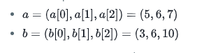
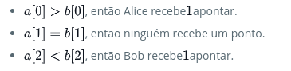
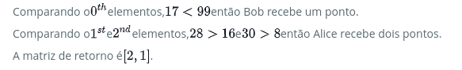

Alice e Bob criaram um problema para o HackerRank. Um revisor classifica os dois desafios, atribuindo pontos em uma escala de 1 a 100 para três categorias: clareza do problema, originalidade e dificuldade.

A classificação para o desafio de Alice é o triplete a = (a[0], a[1], a[2]), e a classificação para o desafio de Bob é o triplete b = (b[0], b[1], b[2]).

A tarefa é encontrar seus pontos de comparação comparando a[0] com b[0], a[1] com b[1] e a[2] com b [2].

Se a[i] > b[i], então Alice recebe 1 ponto.  
Se a[i] < b[i], então Bob recebe 1 ponto.  
Se a[i] = b[i], então nenhuma pessoa recebe um ponto.  
Pontos de comparação é o total de pontos que uma pessoa ganhou.  

Dado a e b, determine seus respectivos pontos de comparação.

#### Exemplo

a = [1, 2, 3] b = [3, 2, 1]

Para os elementos *0*, Bob recebe um ponto porque a[0] .  
Para os elementos iguais a[1] e b[1], não são ganhos pontos.  
Finalmente, para os elementos 2, a[2] > b[2] para que Alice receba um ponto.  
A matriz de retorno é [1, 1] com a pontuação de Alice em primeiro e a de Bob em segundo.  

#### Descrição da função

Complete a função compareTriplets no editor abaixo.

compareTriplets tem o(s) seguinte(s) parâmetro(s):

int a[3]: Classificação de desafio de Alice
int b[3]: Classificação de desafio de Bob  

#### Return

int[2]: A pontuação de Alice está na primeira posição, e a pontuação de Bob está na segunda.  

#### Formato de entrada

A primeira linha contém 3 inteiros separados por espaço, a[0], a[1] e a[2], os respectivos valores em triplete a.  
A segunda linha contém 3 inteiros separados por espaço, b[0], b[1] e b[2], os respectivos valores em triplete b.

#### Restrições  
1 ≤ a[i] ≤ 100  
1 ≤ b[i] ≤ 100  

#### Entrada de amostra: 0  
5 6 7  
3 6 10

#### Saída de amostra: 0  
1 1

#### Explicação 0

Neste exemplo:  
  
Agora, vamos comparar cada pontuação individual:  

A pontuação de comparação de Alice é , e a pontuação de comparação de Bob é 1.
Assim, retornamos o array [1, 1] .

#### Entrada de amostra 1  
17 28 30  
99 16 8

#### Saída de amostra 1  
2 1

#### Explicação 1

